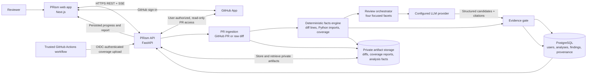

# PRism

**PRism is an evidence-backed pull request review workbench.** It helps engineers inspect large or AI-generated changes by checking the change against its stated intent, the dependencies it touches, and verified test coverage. Every finding shown as verified comes with evidence a reviewer can inspect in the diff.

PRism combines deterministic analysis with model-assisted review. The model can suggest a defect; it cannot make that suggestion verified by itself. A separate evidence gate checks each citation against facts computed from the pull request before the result is presented as verified.

## Why PRism

Large changes are difficult to review consistently. A patch can contradict its description, break a contract used elsewhere, or add an important branch that tests never execute. PRism brings those review signals into one report and makes the supporting lines visible, so a reviewer can quickly decide what deserves attention.

## The review experience

1. **Connect GitHub and choose a change.** Sign in with GitHub, connect an installation, and select a pull request. PRism also accepts a raw unified diff when a GitHub PR is unavailable.
2. **Follow the analysis.** The review page streams stage and facet progress as the analysis runs. If the stream is interrupted, the interface can recover its status through polling.
3. **Inspect the report.** Review findings are ordered by risk and separated into verified findings and an unverified appendix. Each citation links to the relevant location in the private diff.
4. **Check coverage and history.** Coverage status includes its source and commit provenance. Previous analyses remain available in the workspace.

The product includes workspace, reviews, repositories, and method pages. The analysis report brings together the brief, findings, evidence, coverage, and diff so reviewers can move from a claim to its source.

## How an analysis works

PRism first normalizes the pull request into a title, description, commit identifiers when available, and a unified diff. Its facts engine computes changed-line ranges, extracts static dependency edges from changed Python files, and matches validated coverage data to the exact changed commit when available.

The review agent examines those facts and the diff in four focused areas:

| Review area | What it checks |
| --- | --- |
| Intent vs. spec | Whether the change contradicts the pull request's stated behavior or requirements |
| Cross-file impact | Whether a changed contract may affect files connected by known dependency edges |
| Test coverage gaps | Whether newly changed lines have measured zero coverage |
| Risk hazards | Whether changed logic introduces a defect or unsafe behavior |

The provider returns structured finding candidates with citations. The evidence gate checks those citations against the deterministic facts: code claims must point to added lines, dependency claims must match an extracted edge, and coverage-gap claims must match measured uncovered lines. Findings whose evidence does not satisfy the relevant contract remain unverified. Missing or mismatched coverage stays **unknown**; it is never treated as proof of a gap.

## Product architecture

PostgreSQL stores review records and artifact references. Diff and coverage files are held by the configured artifact store; in production this is private S3, while local development can use filesystem storage. The API serves artifacts through authenticated endpoints rather than exposing public bucket URLs. Review progress is persisted and delivered to the web app over server-sent events, with polling available as a recovery path.

## Trust and product boundaries

- **Evidence before confidence:** Model output is a proposal. Citation validation determines whether it can appear as verified.
- **Coverage with provenance:** Coverage is considered only when the report is valid and associated with the analyzed commit. If evidence is absent or invalid, status remains unknown.
- **User-owned access:** GitHub access is tied to the signed-in user and their connected installation. Analyses and artifacts are restricted to their owner.
- **Read-only GitHub integration:** PRism reads repository and pull request data. It does not push commits, approve pull requests, or post review comments.
- **No submitted-code execution:** PRism inspects patch content and trusted coverage reports; it does not run code from a submitted pull request.
- **Provider-swappable review:** The backend uses a provider adapter so the configured LLM provider can be changed without changing the evidence gate.

## Current scope

PRism is focused on individual engineers and engineering leads reviewing GitHub pull requests or raw diffs. Cross-file facts currently include static Python import edges. Coverage intake supports validated LCOV and Cobertura reports, including trusted GitHub Actions OIDC uploads.

Team collaboration, billing, and writing back to GitHub are outside the current product scope. The repository includes an authored six-PR synthetic shop corpus for demonstrations and evaluation. A two-case benchmark pilot exists, but it is too small to support broad claims about review speed or defect detection.

## Technology overview

| Area | Technology |
| --- | --- |
| Web app | Next.js 14 App Router, TypeScript, Tailwind CSS |
| API | FastAPI and Python |
| Persistence | PostgreSQL, SQLAlchemy async, Alembic |
| Review | Provider adapter, deterministic facts engine, citation evidence gate |
| Artifact storage | Local filesystem for development; private Amazon S3 in production |
| Live updates | Server-sent events with polling recovery |

For local development instructions, see [backend/README.md](backend/README.md) and [frontend/README.md](frontend/README.md). For product intent and constraints, see [PRODUCT.md](PRODUCT.md). The synthetic demonstration corpus is documented in [sample_repo/README.md](sample_repo/README.md).
